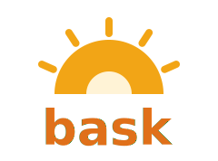
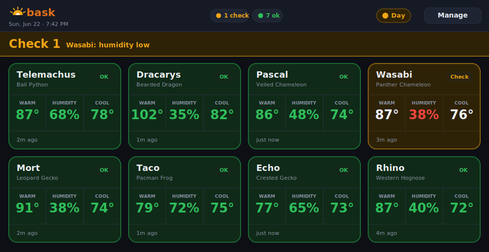

<p align="center">
  
</p>

<p align="center">
  <b>At-a-glance temperature &amp; humidity monitoring for your animal room.</b><br>
  Reads your Bluetooth thermo-hygrometers, groups them by enclosure, and tells you from across the room whether your husbandry is good.
</p>

<p align="center">
  <a href="#license"></a>
  
  
</p>

---

Bask is a small, self-hosted dashboard for reptile/amphibian keepers (or anyone with [Govee H5075](https://www.govee.com/) sensors). It listens to your sensors over Bluetooth, checks each enclosure against **per-species day/night ranges**, and shows a big green "all good" — or a red alert that names exactly what's wrong.

It runs on hardware as small as a **Raspberry Pi Zero W**: the Pi only scans and serves; any browser displays it. No cloud, no account, no internet required.

> **The idea:** walk into your animal room and know instantly — *green or not green* — whether everything's okay. Details are a tap away; status is readable from the doorway.



## Features

- 📡 **Passive Bluetooth scanning** — no pairing, no cloud, no Govee account. Reads the sensors' broadcast advertisements locally.
- 🟢 **At-a-glance status banner** — big green "all good", or a red banner that names the out-of-range enclosure and metric.
- 🦎 **Enclosures + per-species ranges** — group a warm-side and cool-side sensor per enclosure; each species has its own acceptable temp/humidity ranges.
- ☀️🌙 **Day / night ranges** — set different ranges for heat-on vs. heat-off (configurable schedule). The dashboard switches automatically and shows which set is active.
- 🔋 **Battery + signal monitoring** — warns before a sensor dies or drops off.
- 👆 **Touch-first UI** — built for a wall-mounted touchscreen, with proximity pairing (hold a sensor near the host to add it).
- 🪶 **Tiny footprint** — two small Python processes and a vanilla-JS frontend. No build step, no framework, no database server.

## How it works

```
  Govee H5075 sensors            Host (e.g. Raspberry Pi)            Any display
  (in your enclosures)     ┌──────────────────────────────┐    (tablet / browser /
                           │  scanner ──writes──┐          │     smart display)
   temp / humidity / batt  │  (owns Bluetooth)  ▼          │
        │  BLE adverts      │              readings.db      │  HTTP   ┌────────────┐
        └─────────────────▶ │  web server ──reads─┘         │ ◀───────│  browser   │
                           │  (FastAPI + serves the UI)     │  :8080  └────────────┘
                           └──────────────────────────────┘
```

Two processes share one SQLite file so they never contend for the Bluetooth radio:

- **`scanner/`** — the only component that touches Bluetooth. Passively listens for Govee advertisements, decodes temperature/humidity/battery, and writes them to `readings.db`.
- **`server/`** — does no Bluetooth. Reads the database, evaluates each enclosure against its species' (day or night) ranges, and serves the dashboard + JSON API.
- **`frontend/`** — a plain HTML/CSS/JS dashboard served by the web server.

## Hardware

Bask is hardware-agnostic — adapt it to whatever you have:

- **A host with Bluetooth Low Energy** running Linux. A Raspberry Pi (Zero W, Zero 2 W, 3/4/5) is the obvious choice, but any Linux machine with a BLE adapter works. (macOS works for development too.)
- **One or more Govee H5075** sensors (other Govee BLE thermo-hygrometers that broadcast readings may also work).
- **A display** — an old tablet or phone, a monitor on the host, a smart display, or just any browser on your network.

## Install

Bask needs Python 3.11+ and three packages: `bleak`, `fastapi`, and `uvicorn`.

```bash
git clone https://github.com/jlyfshhh/bask.git
cd bask
cp config.example.json config.json
```

Install the Python dependencies. On most systems, pip is easiest:

```bash
pip install -r requirements.txt
```

> **Low-power Pi note:** on the original Raspberry Pi Zero W (ARMv6), some wheels won't build under pip. Install from the system package manager instead:
> ```bash
> sudo apt install -y python3-bleak python3-fastapi python3-uvicorn python3-dbus-fast
> ```

**Linux/BlueZ — enable reliable passive scanning** (recommended; lets the scanner see every advertisement instead of de-duplicated ones):

```bash
sudo sed -i 's/^#*Experimental = .*/Experimental = true/' /etc/bluetooth/main.conf
sudo systemctl restart bluetooth
# add your user to the bluetooth group so the scanner doesn't need root:
sudo usermod -aG bluetooth "$USER"
```

**Run it:**

```bash
./start.sh
```

Then open `http://<host-ip>:8080` in any browser, and tap **⚙ Manage → Sensors → Pair by proximity** to add your sensors.

### Run as a service (recommended)

Two `systemd` units keep the scanner and web server running and start them on boot. Adjust the user and paths, then drop these in `/etc/systemd/system/`:

```ini
# /etc/systemd/system/bask-scanner.service
[Unit]
Description=Bask BLE scanner
After=bluetooth.target network.target
Wants=bluetooth.target
[Service]
User=YOUR_USER
WorkingDirectory=/home/YOUR_USER/bask
ExecStart=/usr/bin/python3 /home/YOUR_USER/bask/scanner/scanner.py
Restart=always
[Install]
WantedBy=multi-user.target
```

```ini
# /etc/systemd/system/bask-web.service
[Unit]
Description=Bask web server
After=network.target bask-scanner.service
[Service]
User=YOUR_USER
WorkingDirectory=/home/YOUR_USER/bask
ExecStart=/usr/bin/python3 -m uvicorn server.app:app --host 0.0.0.0 --port 8080
Restart=always
[Install]
WantedBy=multi-user.target
```

```bash
sudo systemctl enable --now bask-scanner bask-web
```

Run as a **non-root** user that's in the `bluetooth` group — Bask never needs root.

## Configuration

Everything lives in `config.json` (created from `config.example.json`). You don't need to hand-edit it — the **Manage** screen in the UI does it all:

- **Sensors** — discovered Govee devices you've named.
- **Enclosures** — a name + species + which sensor is the warm and cool side.
- **Species** — acceptable ranges, each with a **day** set and an optional **night** set. The day/night schedule (e.g. 8am–8pm) is in **Settings**.
- **Settings** — °F/°C, stale-after timeout, low-battery threshold, and the daytime-hours window.

`config.example.json` ships with day/night ranges for eight common species as a starting point — see the disclaimer below.

## Displaying it

- **Any tablet / phone / computer** — just open the URL. A cheap wall-mounted tablet makes an excellent always-on display.
- **A monitor on the host** — `kiosk.sh` launches a fullscreen browser (it prefers the lightweight [cog](https://github.com/Igalia/cog) WPE browser, with Chromium as a fallback). Rendering a browser on a very low-power host (e.g. Pi Zero W) is slow, so a separate display device is usually smoother.
- **Smart displays** — anything with a web browser works. (For example, an Amazon Echo Show can open the URL in its Silk browser; `frontend/keep.js` includes a small same-origin keep-alive so Silk-class browsers don't time out — it activates only on that user-agent and is a no-op everywhere else.)

## Security

Bask is built for a **trusted local network** and is **not authenticated**. Treat it like any other LAN-only IoT service:

- **Don't expose it to the internet.** Don't port-forward `:8080` or put it on a public network. Anyone who can reach the port can read and change your configuration.
- It binds to `0.0.0.0` so your wall display can reach it. Restrict it with a host firewall, an IoT VLAN, or by binding to a specific interface if you want tighter scoping.
- For remote access, use a **VPN** (e.g. WireGuard/Tailscale) or an authenticating reverse proxy — never the raw port.

What Bask does on its side:

- **No cloud, no accounts, no secrets** — it never touches a Govee account, and stores no credentials. Your `config.json` (sensor IDs + enclosure names) is git-ignored.
- **Same-origin only** — the API sends no permissive CORS headers, so other websites can't read it or send it cross-origin writes.
- **XSS-safe rendering** — all user- and device-provided strings are HTML-escaped, including BLE advertisement names (so a crafted nearby device name can't inject script).
- **Validated input** — request payloads are length- and range-checked.
- **Runs unprivileged** — the services run as a normal user in the `bluetooth` group, not root.

## ⚠️ Husbandry disclaimer

The species ranges in `config.example.json` are **starting points compiled from public care resources, not veterinary advice.** Temperature and humidity needs vary by animal, age, and setup, and **sensor placement matters** (a probe at the basking spot reads hotter than the ambient air, which is usually what you want to alert on). **Verify everything against trusted sources and your own animals, and tune the ranges to your room.** Bask is a monitoring aid, not a substitute for proper research and care.

## Project structure

```
scanner/        BLE scanner — owns Bluetooth, writes readings.db
  scanner.py      main loop: passive scan + batched DB writes
  govee.py        H5075 advertisement decoding
  db.py           shared SQLite layer
server/
  app.py          FastAPI: JSON API, range evaluation, serves the frontend
frontend/         vanilla HTML/CSS/JS dashboard (+ favicon, keep-alive)
config.example.json   copy to config.json
start.sh          run scanner + web server together
kiosk.sh          optional fullscreen browser launcher for a host-attached screen
```

## License

MIT — see [LICENSE](LICENSE).

---

Built by **[jlyfshhh](https://github.com/jlyfshhh)**. I keep a room full of reptiles and amphibians — follow along on Instagram **[@thebioactivekeeper](https://instagram.com/thebioactivekeeper)** for the animals and bioactive builds behind this project. 🦎

> Built with the help of [Claude](https://www.anthropic.com/claude), Anthropic's AI assistant — from the Bluetooth decoding and the dashboard to this README. Reviewed, tested, and deployed by a human (me).
