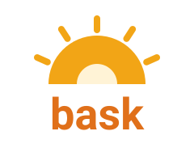
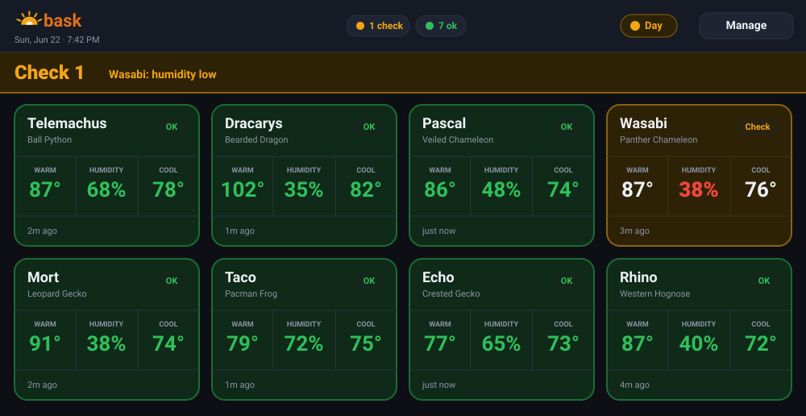

<p align="center">
  
</p>

<p align="center">
  <b>At-a-glance temperature &amp; humidity monitoring for your animal room.</b><br>
  Reads your Bluetooth thermo-hygrometers, groups them by enclosure, and tells you from across the room whether your husbandry is good.
</p>

<p align="center">
  <a href="#license"></a>
  
  
  <a href="https://ko-fi.com/jlyfshhh"></a>
</p>

---

Bask is a small, self-hosted dashboard for reptile/amphibian keepers (or anyone with [Govee H5075](https://a.co/d/0f8luxOE) sensors). It listens to your sensors over Bluetooth, checks each enclosure against **per-species day/night ranges**, and shows a big green "all good" — or a red alert that names exactly what's wrong.

It runs on an inexpensive **Raspberry Pi** — a Pi 4, Pi 3B+, or Zero 2 W all work great: the Pi only scans and serves; any phone, tablet, or browser displays it. No cloud, no account, no internet required.

> **The idea:** walk into your animal room and know instantly — *green or not green* — whether everything's okay. Details are a tap away; status is readable from the doorway.



> 🆕 **New to Raspberry Pi?** The **[beginner's setup guide](docs/SETUP.md)** takes you from a box of parts to a working dashboard in about 30 minutes — what to buy, how to flash the card, and one line to install. Nothing assumed.

## Features

- 📡 **Passive Bluetooth scanning** — no pairing, no cloud, no Govee account. Reads the sensors' broadcast advertisements locally.
- 🟢 **At-a-glance status banner** — big green "all good", or a red banner that names the out-of-range enclosure and metric.
- 🦎 **Enclosures + per-species ranges** — group a warm-side and cool-side sensor per enclosure; each species has its own acceptable temp/humidity ranges.
- ☀️🌙 **Day / night ranges** — set different ranges for heat-on vs. heat-off (configurable schedule). The dashboard switches automatically and shows which set is active.
- 🔋 **Battery + signal monitoring** — warns before a sensor dies or drops off.
- 🌡️ **Herpstat thermostat monitoring** *(optional)* — add [Herpstat SpyderWeb](https://www.spyderrobotics.com/) thermostats by IP and see each output's live probe temp, setpoint, output %, and alarms in a compact strip. Hidden entirely until you add one.
- ❄️ **Animal-room climate** *(optional)* — connect a Cielo Breez Max and see the room temperature, humidity, mini-split mode, and setpoint in a small dashboard-corner card.
- 📲 **Phone alerts** *(optional)* — get a notification on your phone when an enclosure goes out of range or a sensor drops off. Two-minute setup with the free [ntfy](https://ntfy.sh) app; the Pi only sends outbound, so nothing is exposed.
- 📱 **Installs like an app** — add Bask to your phone or tablet's home screen and it launches fullscreen with its own icon, like a native app.
- 👆 **Touch-first UI** — built for a wall-mounted touchscreen, with proximity pairing (hold a sensor near the host to add it).
- 🪶 **Tiny footprint** — two small Python processes and a vanilla-JS frontend. No build step, no framework, no database server.

## How it works

```
  Govee H5075 sensors          Host (e.g. Raspberry Pi)          Any display
  (in your enclosures)     ┌──────────────────────────────┐    (tablet / browser /
                           │  scanner ──writes──┐         │     smart display)
   temp / humidity / batt  │  (owns Bluetooth)  ▼         │
        │  BLE adverts     │              readings.db     │  HTTP   ┌────────────┐
        └────────────────▶ │  web server ──reads─┘        │ ◀───────│  browser   │
                           │  (FastAPI + serves the UI)   │  :8080  └────────────┘
                           └──────────────────────────────┘
```

Two processes share one SQLite file so they never contend for the Bluetooth radio:

- **`scanner/`** — the only component that touches Bluetooth. Passively listens for Govee advertisements, decodes temperature/humidity/battery, and writes them to `readings.db`.
- **`server/`** — does no Bluetooth. Reads the database, evaluates each enclosure against its species' (day or night) ranges, and serves the dashboard + JSON API.
- **`frontend/`** — a plain HTML/CSS/JS dashboard served by the web server.

## Hardware

Bask is hardware-agnostic — adapt it to whatever you have:

- **Any current Raspberry Pi.** A **Pi 4** or **Pi 3B+** is the easy, widely-available pick; a **Pi Zero 2 W** is the most compact and lowest-power; a **Pi 5** works too. They all have built-in Wi‑Fi and Bluetooth and run the same image. *(64-bit models only — the original ARMv6 Pi Zero W / Pi 1 are too slow and not recommended.)* Any other Linux machine with a BLE adapter also works, and macOS works for development.
- **One or more Govee H5075** sensors (other Govee BLE thermo-hygrometers that broadcast readings may also work).
- **A display** — an old tablet or phone, a monitor on the host, a smart display, or just any browser on your network.

## Install

### Easiest — flash the ready-made image (recommended)

No terminal, no commands. **[Download the latest Bask image](https://github.com/jlyfshhh/bask/releases/latest)**, write it to a microSD card with [Raspberry Pi Imager](https://www.raspberrypi.com/software/) (*Choose OS → Use custom*), set your **Wi‑Fi** in Imager's customisation screen, and power on the Pi. A couple of minutes later, open **http://bask.local:8080** on any device on your network. Works on any 64-bit Pi (Pi 3/3B+, 4, 400, 5, Zero 2 W).

New to Raspberry Pi entirely? The **[beginner's setup guide](docs/SETUP.md)** walks through every step with nothing assumed — including what to buy.

### One line on an existing Pi

Already running Raspberry Pi OS with SSH? Just run:

```bash
curl -fsSL https://raw.githubusercontent.com/jlyfshhh/bask/main/get-bask.sh | bash
```

This installs Docker when needed, enables BlueZ passive scanning and mDNS, and
runs Bask as a restart-safe container with its settings and history in
`~/bask/data`. When it finishes it prints your dashboard URL —
`http://<hostname>.local:8080`. Run the same command again any time to update;
the persistent data directory is never replaced.

Already running the former systemd/virtualenv version? The installer stops the
old services, takes a timestamped backup (including a consistent SQLite
snapshot), migrates the settings and history, and starts the container.

### Manual Docker install

Prefer to set it up yourself? With Docker Engine and the Compose plugin installed:

```bash
git clone https://github.com/jlyfshhh/bask.git
cd bask
cp .env.example .env
mkdir -p data backups
docker compose up -d --build
```

On Linux, enable BlueZ's reliable passive scanning mode once:

```bash
sudo sed -i 's/^#*Experimental = .*/Experimental = true/' /etc/bluetooth/main.conf
sudo systemctl restart bluetooth
sudo apt install -y avahi-daemon bluez rfkill
```

Then open `http://<hostname>.local:8080` (or `http://<host-ip>:8080`) in any browser, and tap **⚙ Manage → Sensors → Pair by proximity** to add your sensors.

## Updating

Re-run the one-line installer. It fast-forwards the code and rebuilds the
container while leaving `~/bask/data` untouched:

```bash
curl -fsSL https://raw.githubusercontent.com/jlyfshhh/bask/main/get-bask.sh | bash
```

Settings has a **💾 Download backup** button for portable, secret-free
configuration. `scripts/backup.sh` creates a private filesystem backup of
configuration, SQLite history, and configured Cielo credentials.
Ready-made image installations retain their existing in-app updater.

## Configuration

Everything lives in the persistent `data/` directory (`config.json` plus
`readings.db`). You don't need to hand-edit it — the **Manage** screen in the UI does it all:

- **Sensors** — discovered Govee devices you've named.
- **Enclosures** — a name + species + which sensor is the warm and cool side.
- **Species** — acceptable ranges, each with a **day** set and an optional **night** set. The day/night schedule (e.g. 8am–8pm) is in **Settings**.
- **Thermostats** *(optional)* — Herpstat SpyderWeb units to monitor, by IP. See below.
- **Settings** — °F/°C, stale-after timeout, low-battery threshold, and the daytime-hours window.

`config.example.json` ships with day/night ranges for eight common species as a starting point — see the disclaimer below.

## Herpstat thermostats (optional)

If you run [Herpstat SpyderWeb](https://www.spyderrobotics.com/) thermostats, Bask can show each unit's outputs — live probe temperature, setpoint, output %, and any alarms — in a compact strip above the enclosure grid. It reads each unit's built-in status page over your LAN; there's no cloud and nothing to install on the thermostat. **If you don't add any, the strip never appears.**

**1. Enable the status page on each thermostat.** Bask reads `http://<unit-ip>/RAWSTATUS`, which is off by default. In the unit's network/web settings (via its touchscreen or the Spyder app), turn on the web **status page** (sometimes labelled "web enabled" / "status"). To confirm it's on, open `http://<unit-ip>/RAWSTATUS` in a browser — you should see a page of JSON. A static IP or DHCP reservation for each unit is recommended so its address doesn't change.

**2. Add it in Bask.** Go to **⚙ Manage → Thermostats → + Add**, enter the unit's IP, and tap **⚡ Test connection** to verify before saving. Bask polls each unit every few seconds and caches the result, so an offline or slow unit never stalls the dashboard. Output names come straight from the thermostat, so naming an output after its enclosure (e.g. "Ball Python") lines the strip up with your cards.

### Cielo Breez Max animal-room climate (optional)

Bask can also show a compact, read-only room-climate card from a Cielo Breez Max. Go to **⚙ Manage → Thermostats → Animal room climate → Connect** and paste a Cielo Connect API key. If the account has multiple controllers, choose which one represents the animal room.

Cielo permits an API key to be used only once and currently limits generation to three keys per month. Bask therefore saves the resulting access token and reuses it across restarts. Generate a fresh key, submit it once, and do not revoke it while Bask is using it. The integration polls Cielo's cloud about every two minutes, so it requires internet access; an outage only marks the card stale and never affects enclosure sensor monitoring.

The integration is deliberately **status-only**: Bask cannot turn the mini-split on/off or change its mode or setpoint. The API key and token are stored in `cielo-secrets.json` inside Bask's private data directory with owner-only file permissions. They are excluded from Git, Docker build context, and portable Manage-page exports. The private `scripts/backup.sh` filesystem archive includes them with owner-only permissions so a full server restore can preserve the integration; protect that archive like any other credential backup.

See Cielo's [Breez Max integration instructions](https://support.cielowigle.com/hc/en-us/articles/40965394269079-How-to-integrate-Home-Assistant-with-Breez-Max) for where to generate a Cielo Connect key.

## Phone alerts (optional)

Bask can ping your phone when an enclosure goes out of range, loses signal, or recovers. It uses [ntfy](https://ntfy.sh), a free open-source notification service: Bask generates a private, random topic for your install, and the Pi **posts outbound only** — nothing on your network is exposed, and Bask still needs no account.

Setup takes about two minutes: **⚙ Manage → Settings → Set up phone alerts**, install the free ntfy app (App Store / Google Play), and scan the QR code Bask shows you. Tap **Send test** to confirm. Alerts fire on status *transitions* (in-range → out-of-range and back), so you get one ping per event, not a flood.

> Your topic name is effectively a password — anyone who knows it can see your alerts (enclosure names and readings only). Bask generates a long random one; keep it private. Self-hosting an ntfy server also works — set `ntfy.server` in `config.json`.

## Displaying it

- **Any tablet / phone / computer** — just open the URL. A cheap wall-mounted tablet makes an excellent always-on display. On a phone or tablet, use your browser's **Add to Home Screen** — Bask installs like an app and launches fullscreen.
- **A monitor on the host** — `kiosk.sh` launches a fullscreen browser (it prefers the lightweight [cog](https://github.com/Igalia/cog) WPE browser, with Chromium as a fallback). Rendering a browser on a very low-power host (e.g. Pi Zero W) is slow, so a separate display device is usually smoother.
- **Smart displays** — anything with a web browser works. (For example, an Amazon Echo Show can open the URL in its Silk browser; `frontend/keep.js` includes a small same-origin keep-alive so Silk-class browsers don't time out — it activates only on that user-agent and is a no-op everywhere else.)

## Security

Bask is built for a **trusted local network** and is **not authenticated**. Treat it like any other LAN-only IoT service:

- **Don't expose it to the internet.** Don't port-forward `:8080` or put it on a public network. Anyone who can reach the port can read and change your configuration.
- It binds to `0.0.0.0` so your wall display can reach it. Restrict it with a host firewall, an IoT VLAN, or by binding to a specific interface if you want tighter scoping.
- For remote access, use a **VPN** (e.g. WireGuard/Tailscale) or an authenticating reverse proxy — never the raw port.

What Bask does on its side:

- **No cloud, no accounts, no secrets** — it never touches a Govee account, and stores no credentials. Your `config.json` (sensor IDs + enclosure names) is git-ignored.
- **Same-origin only** — the API sends no permissive CORS headers, so other websites can't read it or send it cross-origin writes.
- **XSS-safe rendering** — all user- and device-provided strings are HTML-escaped, including BLE advertisement names (so a crafted nearby device name can't inject script).
- **Validated input** — request payloads are length- and range-checked.
- **Runs unprivileged** — the services run as a normal user in the `bluetooth` group, not root.

## ⚠️ Husbandry disclaimer

The species ranges in `config.example.json` are **starting points compiled from public care resources, not veterinary advice.** Temperature and humidity needs vary by animal, age, and setup, and **sensor placement matters** (a probe at the basking spot reads hotter than the ambient air, which is usually what you want to alert on). **Verify everything against trusted sources and your own animals, and tune the ranges to your room.** Bask is a monitoring aid, not a substitute for proper research and care.

## Project structure

```
scanner/        BLE scanner — owns Bluetooth, writes readings.db
  scanner.py      main loop: passive scan + batched DB writes
  govee.py        H5075 advertisement decoding
  db.py           shared SQLite layer
server/
  app.py          FastAPI: JSON API, range evaluation, serves the frontend
frontend/         vanilla HTML/CSS/JS dashboard (+ favicon, keep-alive)
config.example.json   copy to config.json
Dockerfile        portable multi-architecture Bask container
compose.yaml      service, Bluetooth D-Bus access, port, and persistent volume
get-bask.sh       one-line installer and safe legacy migration
deploy/install.sh installs Docker/BlueZ/mDNS and starts the container
scripts/backup.sh consistent settings + SQLite backup
start.sh          run scanner + web server together (local/dev)
kiosk.sh          optional fullscreen browser launcher for a host-attached screen
docs/SETUP.md     complete beginner's guide (hardware → flashing → install)
```

## Bask + Shed = Haven

Bask can run by itself, or alongside Shed:

| | Project | What it watches |
|---|---|---|
| ☀️ | **Bask** *(this repo)* | The environment — live temperature & humidity on a wall display |
| 🐍 | **[Shed](https://github.com/jlyfshhh/shed)** | The care — feeding, weights, enclosure work, and history for terrestrial animals |
| 🌿 | **Haven** | The combined room view — enclosure status and today's care in one glance |

Haven is not a third database. It is the secure, read-only room dashboard that
appears when Bask and Shed are installed together. The apps remain separate, so
either can still work independently and each keeps its own portable data.

Choose Bask, Shed, or the combined Haven setup from the
**[Haven installer](https://github.com/jlyfshhh/animal-room)**.

## 🦗 Buy the animals some crickets

Bask is free and always will be, but if it saved one of your animals a rough night, or you just think it's neat, you can chip in a couple bucks toward the cricket fund.

<p align="center">
  <a href="https://ko-fi.com/jlyfshhh"></a>
</p>

## License

MIT — see [LICENSE](LICENSE).

---

Built by **[jlyfshhh](https://github.com/jlyfshhh)**. I keep a room full of reptiles and amphibians — follow along on Instagram **[@thebioactivekeeper](https://instagram.com/thebioactivekeeper)** for the animals and bioactive builds behind this project. 🦎

> Built with the help of [Claude](https://www.anthropic.com/claude), Anthropic's AI assistant — from the Bluetooth decoding and the dashboard to this README. Reviewed, tested, and deployed by a human (me).
