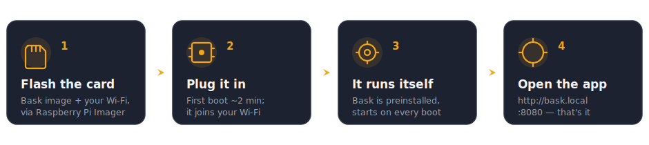

# Bask setup — the complete beginner's guide

Never touched a Raspberry Pi before? That's fine. This guide takes you from a box of parts to a working dashboard on your wall, step by step. No prior experience needed. Set aside about **30 minutes** (most of it is the Pi installing things by itself).



> **The short version:** flash an SD card with a free app, plug it into the Pi, paste one line, then open **http://bask.local:8080**. The rest of this page is just that — slowly, with nothing assumed.

---

## 1. What to buy

You need a small always-on computer (a Raspberry Pi) and an SD card for it. Here's a complete, no-guesswork list:

| Item | What it's for | Notes |
|---|---|---|
| **A Raspberry Pi** | The little computer that runs Bask | Any current model: a **Pi 4** or **Pi 3B+** is the easiest to buy; a **Zero 2 W** is the tiniest. All have built-in Wi‑Fi **and** Bluetooth. *(Avoid the old single-core **Pi Zero W** / Pi 1 — too slow.)* |
| **microSD card, 16 GB+** | Its hard drive | Any decent brand (SanDisk, Samsung). "Class 10 / A1" is plenty. |
| **A USB power supply** | Power | Whatever matches your Pi: **Pi 4** uses **USB‑C**; **Pi 3 / Zero 2 W** use **micro‑USB**. A good phone charger (5V, 2.5A+) works. |
| **A computer** | To set up the SD card once | Windows, Mac, or Linux — anything. You only need it for setup. |
| **Your Govee H5075 sensors** | The thermometers Bask reads | One or more. Fresh batteries help. |
| *(optional)* A small case | Keeps the Pi tidy | Nice to have, not required. |

> 💡 **Which Pi should I get?** If you're buying one, a **Pi 4 (2GB)** or **Pi 3B+** is the most foolproof and the easiest to find in stock. The **Zero 2 W** is great if you want the smallest, lowest-power option (but it's often out of stock — [rpilocator.com](https://rpilocator.com) tracks who has Pis available). They all run the exact same Bask setup, so just grab whichever you can get.

---

## 2. Flash the SD card

"Flashing" just means copying the operating system onto the card. There's an official free app that does it all.

1. On your computer, download **Raspberry Pi Imager** from **[raspberrypi.com/software](https://www.raspberrypi.com/software/)** and install it.
2. Put your microSD card into your computer (use a USB adapter if needed).
3. Open Raspberry Pi Imager and set the three buttons:
   - **Choose Device** → the Pi model you have (e.g. *Raspberry Pi 4* or *Raspberry Pi Zero 2 W*).
   - **Choose OS** → *Raspberry Pi OS (other)* → **Raspberry Pi OS Lite (64‑bit)**. ("Lite" has no desktop — exactly what we want for an appliance.)
   - **Choose Storage** → your SD card. **Double‑check you picked the card and not your hard drive.**
4. Click **Next**. When it asks *"Would you like to apply OS customisation settings?"*, click **Edit Settings**. This step is what makes everything else painless — fill it in carefully:
   - **Set hostname:** `bask`  ← this is what makes `bask.local` work later.
   - **Enable SSH** (on the *Services* tab) → *Use password authentication*.
   - **Set username and password:** pick a username (e.g. `keeper`) and a password you'll remember. **Write these down** — you'll type them once.
   - **Configure wireless LAN:** your Wi‑Fi network name and password, and your country.
   - **Set locale / time zone** to yours.
5. **Save**, then **Yes** to apply the settings, then **Yes** to write. It copies and verifies — a few minutes. When it says you can remove the card, do so.

> If the wording differs slightly by version, the gist is the same: pick OS Lite, and use the **gear / Edit Settings** screen to set **hostname = bask**, **SSH on**, **a username + password**, and **your Wi‑Fi**.

---

## 3. First boot

1. Put the SD card into the Pi.
2. Plug the **power** into the Pi's power port (labelled `PWR` — USB‑C on a Pi 4, micro‑USB on a Pi 3 or Zero 2 W).
3. Wait about **2 minutes** for its first start‑up. There's no screen — that's normal. It's quietly joining your Wi‑Fi.

---

## 4. Install Bask (one line)

Now you'll connect to the Pi from your computer and paste a single command.

1. Open a terminal on your computer:
   - **Mac:** open the **Terminal** app (Applications → Utilities).
   - **Windows:** open **PowerShell** or **Windows Terminal** (Start menu → type "PowerShell").
2. Connect to the Pi by typing this (use the **username** you chose in step 2):

   ```bash
   ssh keeper@bask.local
   ```

   The first time, it asks *"Are you sure you want to continue connecting?"* — type **`yes`**. Then enter the **password** you set. (You won't see the password as you type — that's normal.)

   > Can't connect? Jump to [Troubleshooting](#troubleshooting) — it's almost always one small thing.

3. Once you're connected (the prompt now shows your Pi), paste this **one line** and press Enter:

   ```bash
   curl -fsSL https://raw.githubusercontent.com/jlyfshhh/bask/main/get-bask.sh | bash
   ```

   It downloads Bask, installs what it needs, and sets it to start automatically forever. On a Zero 2 W this takes a **few minutes** — let it run. When it's done, it prints your dashboard address.

---

## 5. Open the dashboard

1. On your **phone, tablet, or computer** (connected to the same Wi‑Fi), open a web browser and go to:

   **http://bask.local:8080**

2. You'll see the Bask dashboard. Tap **⚙ Manage → Sensors → Pair by proximity**, then hold a Govee sensor a few inches from the Pi. When it pops up, tap to assign it to an enclosure's warm or cool side. Repeat for each sensor.
3. Set up your **enclosures** and **species ranges** under **⚙ Manage** so Bask knows what "good" looks like.

That's it. Leave the Pi plugged in — it starts Bask automatically every time it powers on. For wall‑mounting and always‑on display ideas, see **[Displaying it](../README.md#displaying-it)** in the main README.

Running Herpstat thermostats too? See **[Herpstat thermostats](../README.md#herpstat-thermostats-optional)**.

---

## Troubleshooting

**`ssh: could not resolve hostname bask.local` (or the dashboard URL won't load).**
Your network may not support `.local` names. Find the Pi's IP address instead:
- Open your Wi‑Fi router's admin page and look in its list of connected devices for **`bask`** — note its IP (looks like `192.168.1.42`).
- Then use that number everywhere instead of `bask.local`: `ssh keeper@192.168.1.42`, and open `http://192.168.1.42:8080`.
- **Windows only:** `.local` names need Apple's *Bonjour* service. If you have iTunes installed you already have it; otherwise the IP‑address method above always works.

**"Connection refused" right after install.**
The Pi Zero 2 W is small — give it a minute after install to start up, then refresh. You can check it's running with `sudo systemctl status bask-web`.

**Dashboard loads but no sensors appear.**
Make sure the sensors have good batteries and are within a few feet of the Pi while pairing. Give the scanner a minute to hear them. The Govee Home app can confirm a sensor is alive.

**I made a typo in the Wi‑Fi or hostname when flashing.**
Easiest fix is to re‑flash the card (step 2) and fill in the **Edit Settings** screen again. It only takes a few minutes.

**How do I update Bask later?**
Connect again (`ssh keeper@bask.local`) and run the same one‑line installer. It pulls the latest version and restarts automatically.

**How do I see what it's doing / read logs?**
`journalctl -u bask-scanner -f` (Bluetooth scanner) or `journalctl -u bask-web -f` (dashboard). Press `Ctrl+C` to stop watching.
