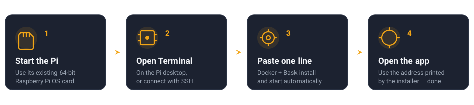

# Bask setup — the complete beginner's guide

Already have a Raspberry Pi with a working SD card? Great—you can keep it.
This guide takes you from Raspberry Pi OS to a working Bask dashboard with one
installer command. You do not need to know Docker, Linux, or programming. Set
aside about **20 minutes**.



> **The short version:** connect a 64-bit Raspberry Pi to your network, open
> Terminal, paste the Bask install command, then open the address it prints.

---

## 1. What you need

| Item | What it's for | Notes |
|---|---|---|
| **A 64-bit Raspberry Pi** | The little computer that runs Bask | Pi 3B+, 4, 5, 400, or Zero 2 W. The original Pi Zero W and Pi 1 are not supported. |
| **Raspberry Pi OS (64-bit)** | The operating system | Many kits include a card that already boots. Use it if it is 64-bit and current. |
| **Power and a network connection** | Keeps Bask available | Wi-Fi works; Ethernet is even simpler when your Pi has a port. |
| **Govee H5075 sensors** | The thermometers Bask reads | Start with one or more and use fresh batteries. |
| **A phone, tablet, or computer** | Displays Bask | It only needs a browser on the same home network. |

If your Pi already reaches its desktop or command prompt, skip to **Step 3**.

## 2. Only if your card does not already work: install Raspberry Pi OS

Use the official **[Raspberry Pi Imager](https://www.raspberrypi.com/software/)**
on a Mac, Windows PC, or Linux computer:

1. Insert the Pi's microSD card into the computer.
2. In Imager, choose your Pi model.
3. Choose **Raspberry Pi OS (64-bit)**. The desktop edition is easiest for a
   first-time user; Lite also works for a headless Pi.
4. Choose the SD card. Double-check the selection because writing erases it.
5. In OS customisation, set a hostname, username, password, Wi-Fi, country, and
   time zone. Enable **SSH** if you want to install from another computer.
6. Write the card, put it in the Pi, power it on, and allow a few minutes for
   the first boot.

## 3. Open Terminal

Choose whichever route is easier.

### Directly on the Pi

If the Pi is connected to a monitor, finish the Raspberry Pi OS welcome screens,
connect to Wi-Fi, then click the black **Terminal** icon in the top bar.

### From another computer with SSH

SSH must be enabled on the Pi. On Raspberry Pi OS Desktop, open
**Preferences → Raspberry Pi Configuration → Interfaces** and turn on **SSH**.
Then open Terminal on a Mac/Linux computer or PowerShell on Windows and enter:

```text
ssh YOUR-PI-USERNAME@raspberrypi.local
```

Replace `YOUR-PI-USERNAME` with the username chosen when the card was set up.
If you chose a different hostname, replace `raspberrypi` with it. The first
connection asks whether to continue; type `yes`, then enter the Pi password.

## 4. Install Bask

Paste this entire line into Terminal and press Enter:

```bash
curl -fsSL https://animalroom.app/bask/install.sh | bash
```

The installer may ask for the Pi password while it prepares Docker and
Bluetooth. It then downloads Bask, creates private persistent storage, and sets
the container to start automatically whenever the Pi boots. The first install
can take several minutes.

When it finishes, it prints an address similar to:

```text
http://raspberrypi.local:8080
```

Leave the Pi powered on. Bask's configuration and history live in
`~/bask/data`, outside the replaceable container.

### Write down the Head Keeper key

The installer also prints a **Head Keeper key**, once:

```text
Head Keeper key:  bask_XXXXXXXXXXXXXXXXXXXXXXXX
```

Save it somewhere you'll find it again. Bask stores only a hash of it, so
nobody — including you — can read it back out later.

Anyone in the house can open the dashboard and read it without the key. The key
is only needed to *change* the setup: adding sensors, editing enclosures and
species ranges, connecting a thermostat or humidifier, phone alerts, backups,
and updates.

You can change it any time under **⚙ Manage → Settings → Head Keeper key** —
including setting it to the same Head Keeper code you use in Shed, so the
household only has one to remember.

If you lose it: edit `~/bask/data/config.json`, delete the `"keeper"` block,
and restart Bask (`cd ~/bask && docker compose restart`). That returns Bask to
being fully open so you can set a new key.

## 5. Open Bask and add the first sensor

1. On a phone, tablet, or computer connected to the same home network, open the
   address printed by the installer.
2. Tap **⚙ Manage → Sensors → Pair by proximity**.
3. Hold a Govee sensor a few inches from the Pi. When it appears, give it a name
   and assign it to an enclosure's warm or cool side.
4. Under **⚙ Manage**, create the enclosure and review its species ranges so
   Bask knows what “good” means for your setup.

Optional next steps:

- **Add to Home Screen** from your phone or tablet browser to install Bask like
  an app.
- Open **⚙ Manage → Settings → Set up phone alerts** to connect the optional
  ntfy notifications.
- See [Herpstat thermostats](../README.md#herpstat-thermostats-optional) and
  [Displaying Bask](../README.md#displaying-it) for additional integrations and
  wall-display options.

## Updating Bask

Run the same installer command again. It downloads the latest code and rebuilds
the container without replacing `~/bask/data`:

```bash
curl -fsSL https://animalroom.app/bask/install.sh | bash
```

Use **⚙ Manage → Settings → Download backup** periodically. Technical users can
also run `~/bask/scripts/backup.sh` for a private archive containing settings,
SQLite history, and configured Cielo credentials.

## Troubleshooting

### The printed `.local` address will not load

- Give the container another minute, then reload.
- Make sure the viewing device is on the same home network as the Pi.
- Find the Pi's IP address in your router's connected-device list, then open
  `http://PI-IP-ADDRESS:8080`.
- On Windows networks where `.local` discovery is unavailable, using the IP
  address is the simplest solution.

### The installer says the OS is unsupported

Bask requires a 64-bit operating system. Install **Raspberry Pi OS (64-bit)**
with Raspberry Pi Imager. The original Pi Zero W and Pi 1 cannot run this
Docker configuration; a Zero 2 W or newer model can.

### The dashboard loads but no sensors appear

Make sure the Govee sensors have good batteries and are near the Pi while
pairing. Give the Bluetooth scanner a minute to hear them. The Govee Home app
can help confirm that a sensor is broadcasting.

### The installation stopped or Bask will not start

Run the same installer command again; completed steps are safe to repeat. For
technical diagnostics, run:

```bash
cd ~/bask
docker compose ps
docker compose logs --tail=100
```

### I already used the former Bask image/systemd version

Run the current installer normally. It detects the former installation, stops
the old services, creates a timestamped SQLite backup, migrates your settings
and history into `~/bask/data`, and starts the Docker version.
